## Setting up your development environment {docsify-ignore}

<br />

> [!NOTE|style:flat|label:What is this] **After completing this tutorial**, your machine will be setup with all the software and configurations required for using SMA's SDK. You will be able to **easily generate new Plugins using the SDK templates**.
>
> In the [next tutorial](plugin-dev-guide-2-the-essentials.md) of our series, we will create a sample Plugin and explore the essential components that a developer can use when coding Plugins.

### Pre-requirements

🖥️ The **technical requirements** for developing Plugins mainly revolve around being able to run SMA and SM. During this guide we will assume that your machine:

- Is running *Windows 7 or 10*. Earlier versions of the OS might work but haven't been tested for this guide,
- Has an *up-to-date* version of the OS,
- Has at least *10GB of free space* that can be dedicated to installing software (if you don't have them installed yet),
- Has a version of *SuperMemo* installed which is compatible with SMA,
- Has an up-to-date version of *SMA* installed.

👩‍🎓 For **personal, skill-wise requirements**, this guide assumes that you:

- Can find your way around the Windows OS,
- Have at least a working-level understanding of [C# and OOP](https://docs.microsoft.com/en-us/dotnet/csharp/) (you can write simple programs, know how classes and inheritance work, know what [interfaces and APIs](https://docs.microsoft.com/en-us/dotnet/csharp/programming-guide/interfaces/) are and how to use them, etc.),
- Have at least a working-level understanding of [Git](https://hackernoon.com/understanding-git-fcffd87c15a3).

Everything else will be taken care of during this guide.

### Installing the required software

####  Git

For the purpose of this guide we will be installing *Git for Windows* and *Tortoise git*. If you know your way around git and have different preferences, feel free to skip this step.

##### Git for Windows

**Git for windows** is - surprise surprise - an implementation of the [Git versioning system](https://hackernoon.com/understanding-git-fcffd87c15a3) for Windows. It provides a set of command-line executables (.exe files) to run git operations, such as clone, pull, push, etc.

We will create a GitHub repository in the following tutorial and use it to make our first plugin.

Why you may ask ? This is a good practice which can save you the trouble of a wide array of more or less catastrophic issues, and it will only take about 5-10 minutes when setting things up from scratch, if done correctly.

?> Download the latest version of [Git for Windows here](https://git-scm.com/download/win).

|Step 3|Step 5|Step 6|Step 7|
|:----:|:----:|:----:|:----:|
|[](content/images/plugins/plugin-guide-1-setup/dev-setup-git-step-3.png ':ignore @class="no-after"')|[](content/images/plugins/plugin-guide-1-setup/dev-setup-git-step-5.png ':ignore @class="no-after"')|[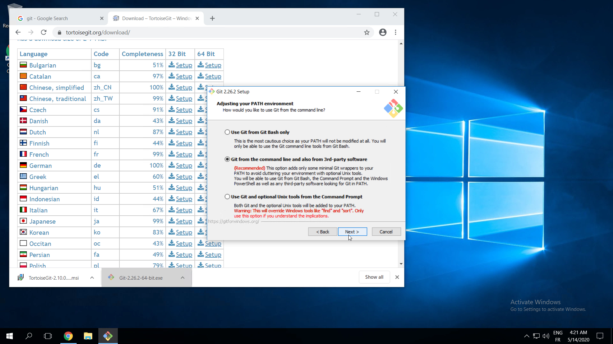](content/images/plugins/plugin-guide-1-setup/dev-setup-git-step-6.png ':ignore @class="no-after"')|[](content/images/plugins/plugin-guide-1-setup/dev-setup-git-step-7.png ':ignore @class="no-after"')|
|**Step 8**|**Step 9**|**Step 10**||
[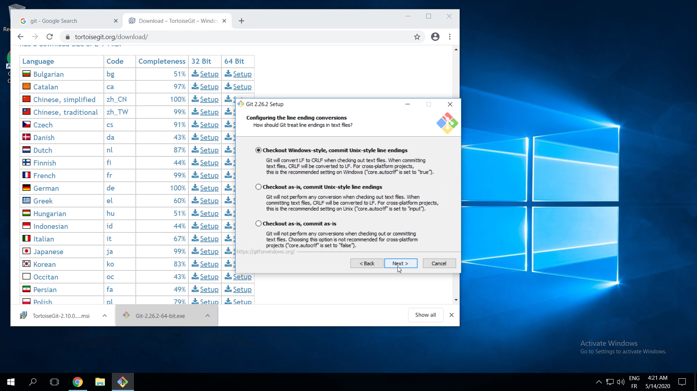](content/images/plugins/plugin-guide-1-setup/dev-setup-git-step-8.png ':ignore @class="no-after"')|[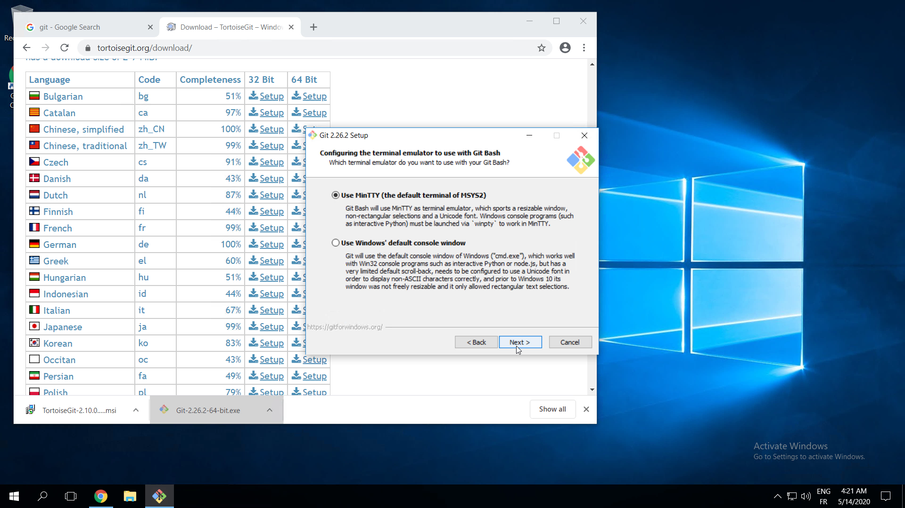](content/images/plugins/plugin-guide-1-setup/dev-setup-git-step-9.png ':ignore @class="no-after"')|[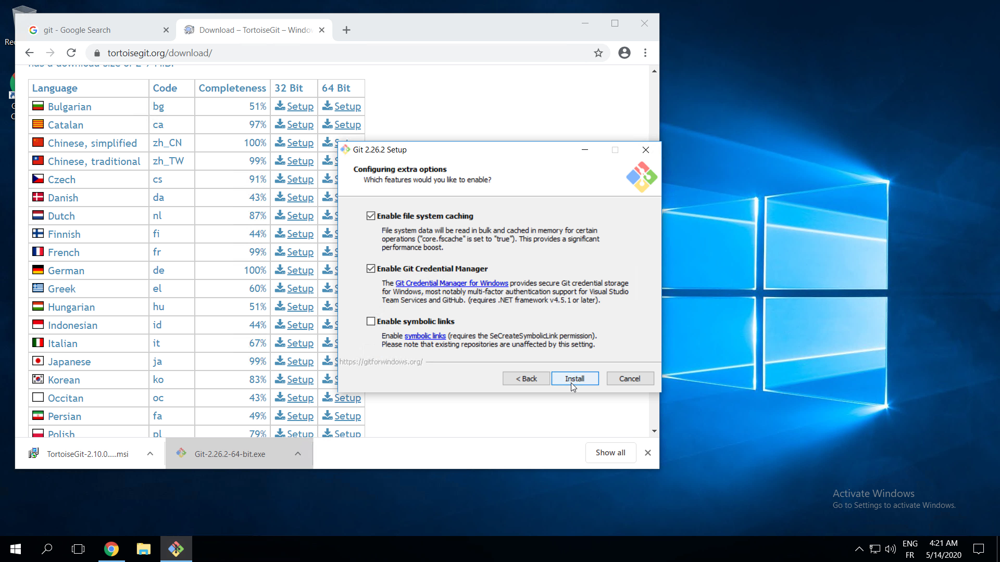](content/images/plugins/plugin-guide-1-setup/dev-setup-git-step-10.png ':ignore @class="no-after"')|

##### Configuring Git

1. Open a command prompt
  - Press <kbd class="win"></kbd> + <kbd>R</kbd>
  - Type `cmd` and then press <kbd>Enter</kbd>
2. Run the following two commands (with your own name and email):

   ```
   git config --global user.name "SuperMemo"
   git config --global user.email help@supermemo.com
   ```

##### Tortoise Git

**Tortoise Git** is a graphical interface for git. While it doesn't itself provide the essential tools for running git operations, it makes working with Git easier by adding a UI on top of **Git for Windows**' command line tools.

If you prefer to use the command-line, feel free to skip this step.

?> Download the latest version of [Tortoise Git here](https://tortoisegit.org/download/).

|Step 1|Step 2|Step 3|Step 4|
|:----:|:----:|:----:|:----:|
|[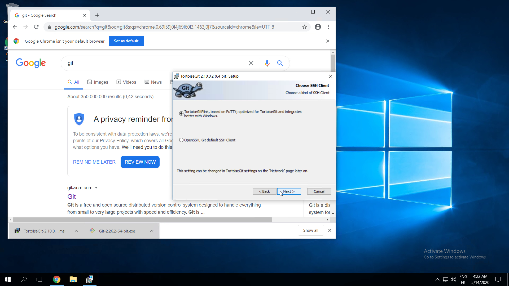](content/images/plugins/plugin-guide-1-setup/dev-setup-tortoise-git-step-1.png ':ignore @class="no-after"')|[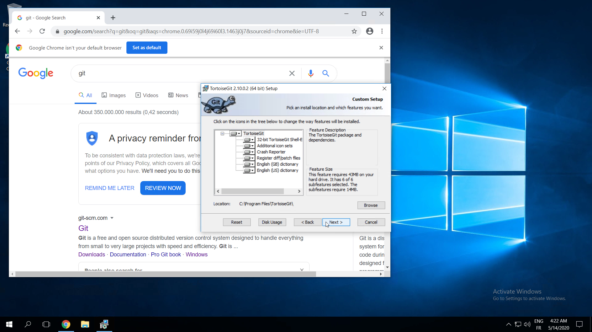](content/images/plugins/plugin-guide-1-setup/dev-setup-tortoise-git-step-2.png ':ignore @class="no-after"')|[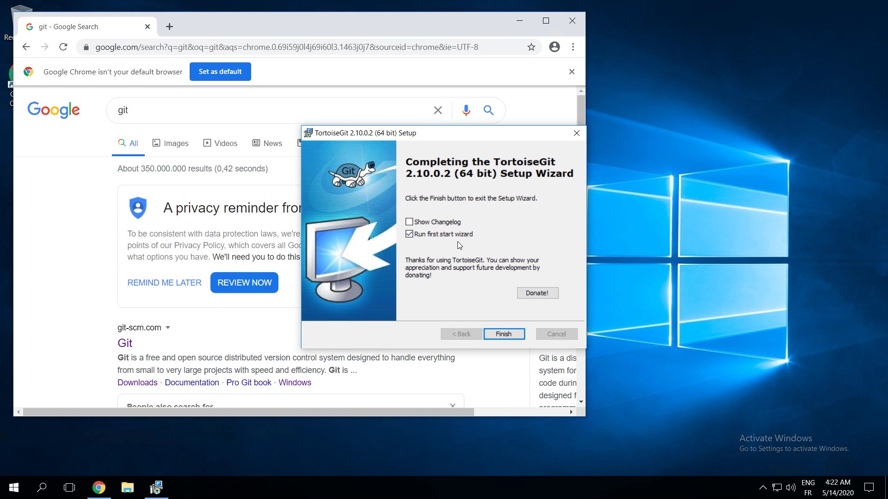](content/images/plugins/plugin-guide-1-setup/dev-setup-tortoise-git-step-3.png ':ignore @class="no-after"')|[](content/images/plugins/plugin-guide-1-setup/dev-setup-tortoise-git-step-4.png ':ignore @class="no-after"')|
|**Step 5**|**Step 6**|||
[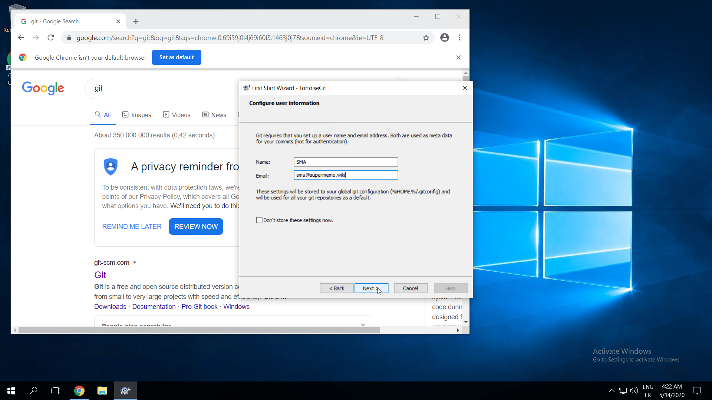](content/images/plugins/plugin-guide-1-setup/dev-setup-tortoise-git-step-5.png ':ignore @class="no-after"')|[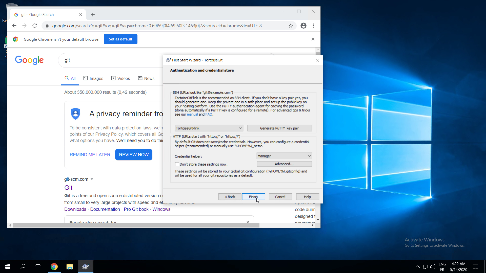](content/images/plugins/plugin-guide-1-setup/dev-setup-tortoise-git-step-6.png ':ignore @class="no-after"')|||

####  Visual Studio

**Visual Studio** is one of the most popular IDEs for developing with C#. You will need to use <u>VS 2019 or higher</u><sup>1</sup> to write your Plugins. Visual Studio offers a free edition called *Community Edition*.

?> Download the latest version of [Visual Studio here](https://visualstudio.microsoft.com/downloads/) (View [picture 🖼️ 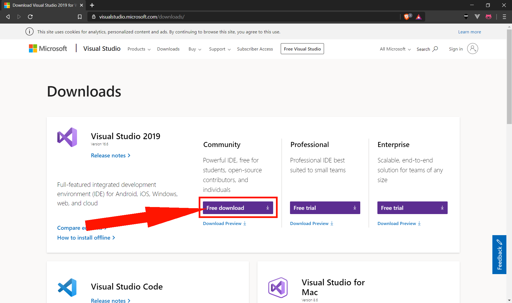](content/images/plugins/plugin-guide-1-setup/dev-setup-vs-download.png ':ignore @tooltip-preview')).

> [!NOTE] <sup>1</sup> The SMA SDK uses the new [MSBuild project SDK](https://docs.microsoft.com/en-us/visualstudio/msbuild/how-to-use-project-sdk?view=vs-2019) feature which is only available starting from VS 2019.

After running the installer and letting it download (Step 1), select at minimum the following **components** for install:
- .NET desktop development (Step 2 -- required for [WPF](https://en.wikipedia.org/wiki/Windows_Presentation_Foundation)),
- .NET Core cross-platform development (Step 3 -- required for the MSBuild SDK).

|Step 1|Step 2|Step 3|Step 4|
|:----:|:----:|:----:|:----:|
[](content/images/plugins/plugin-guide-1-setup/dev-setup-vs-step-1.png ':ignore @class="no-after"')|[](content/images/plugins/plugin-guide-1-setup/dev-setup-vs-step-2.png ':ignore @class="no-after"')|[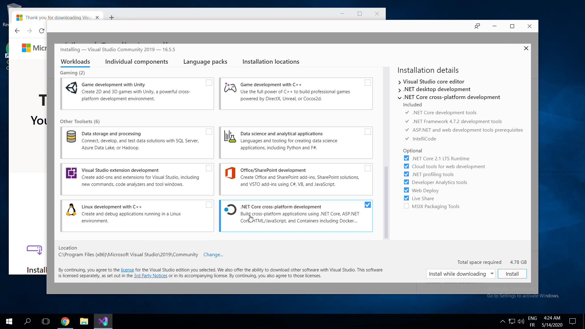](content/images/plugins/plugin-guide-1-setup/dev-setup-vs-step-3.png ':ignore @class="no-after"')|[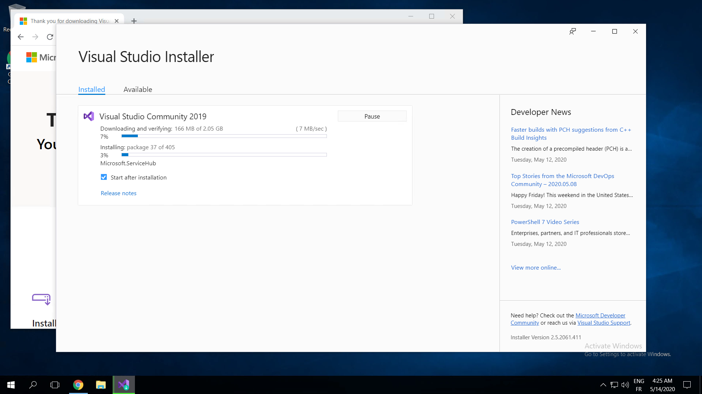](content/images/plugins/plugin-guide-1-setup/dev-setup-vs-step-4.png ':ignore @class="no-after"')|

### Installing the VS extensions

#### (Required) Git Hooks for VS

**Git Hooks** (free) automatically installs <dfn aria-label="Scripts that run automatically every time a particular event occurs in a Git repository. They let you customize Git’s behavior and trigger customizable actions.">[git hooks](https://www.atlassian.com/git/tutorials/git-hooks)</dfn> in your repository. The extension will install the *Git hooks bundled in the SMA SDK* which help you improve your code quality: Tests, Commit message syntax validation, etc.

?> Download the latest version of [Git Hooks for VS here](https://marketplace.visualstudio.com/items?itemName=AlexisIncogito.VisualStudio-Git-Hooks).

#### (Required) SuperMemo Assistant SDK

**SuperMemo Assistant SDK** (free) installs project templates into Visual Studio to bootstrap new Plugins and allow you to immediately get started on the code that matters.

Future versions will include additional features to further facilitate coding and deploying your Plugins.

?> Download the latest version of [SMA SDK here](https://marketplace.visualstudio.com/items?itemName=SuperMemo-wiki.SuperMemoAssistant-Sdk-VisualStudio).

#### (Optional) Automatic Version 2

**Automatic Version 2** (free) allows you to easily increment your Plugin's version. We will discuss this topic in detail later: SMA SDK integrates several features to easily package and publish your Plugins.

?> Download the latest version of [Automatic Version 2 here](https://marketplace.visualstudio.com/items?itemName=PrecisionInfinity.AutomaticVersions).

#### (Optional) I Hate #Regions

**I Hate #Regions** (free) make the C# `#region` keyword actually useful by automatically [expanding all regions 🖼️](https://gweltaz27.gallerycdn.vsassets.io/extensions/gweltaz27/ihateregions/1.4.2/1540212297786/Regions2.png '@tooltip-preview'), allowing you to choose which region to fold when necessary.

It is especially useful when used in combination with *Region Highlights* and *Resharper* (see below).

?> Download the latest version of [I Hate #Regions here](https://marketplace.visualstudio.com/items?itemName=Gweltaz27.IHateRegions).

#### (Optional) Region Highlights

**Region Highlights** (free) makes C# regions more visible by adding [demarcation lines 🖼️](https://paulrogero.gallerycdn.vsassets.io/extensions/paulrogero/regionhighlights/1.25/1566330053445/Screenshot.jpg '@tooltip-preview').

It is especially useful when used in combination with *I Hate #Regions* and *Resharper* (see above and below).

?> Download the latest version of [Region Highlights here](https://marketplace.visualstudio.com/items?itemName=PaulRogero.RegionHighlights).

#### (Optional) ReSharper

**Resharper** (paid) adds many new functionalities to Visual Studio.

SMA heavily relies on Resharper's ability to automatically format code based on user-defined rules to keep its code base as clean and readable as possible. When you create a Plugin using the SDK's templates, the Resharper rules used in SMA will automatically be added to your solution.

Beware though: one of Resharper's main downsides is its tendency to negatively impact Visual Studio's performance. Feel free to give the free trial a chance, and check for yourself.

It is especially useful when used it in combination with *I Hate #Regions* and *Region Highlights* (see above).

?> Download the latest version of [Resharper here](https://www.jetbrains.com/resharper/).

### Creating a plugin

That's the end of this tutorial. In the [next tutorial](plugin-dev-guide-2-the-essentials.md) of our series, we will create a sample Plugin and explore the essential components that a developer can use when coding Plugins.
