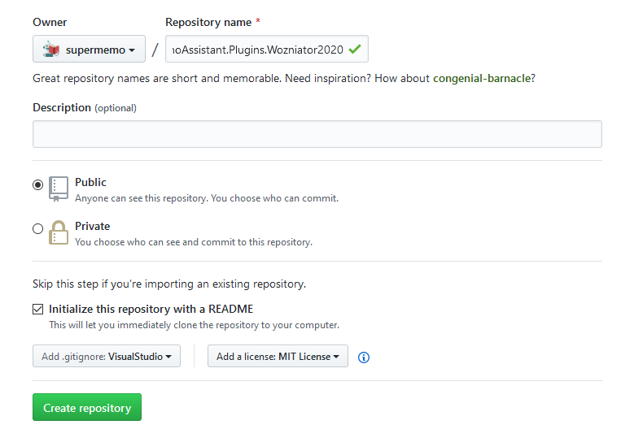
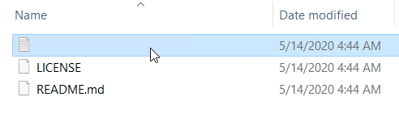
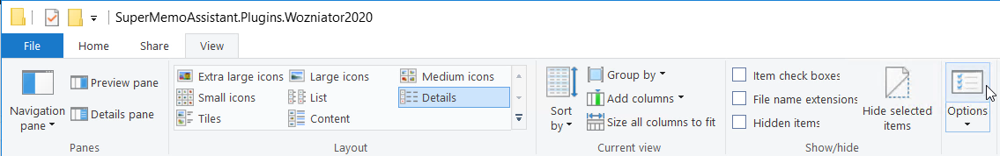
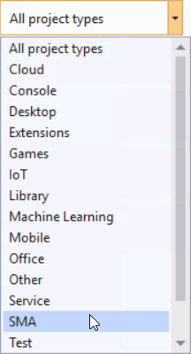
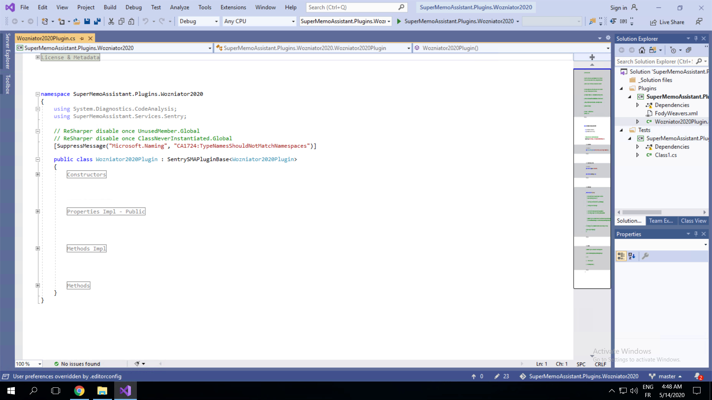

## Plugins: The essentials {docsify-ignore}

 

> [!NOTE|style:flat|label:What is this] **After completing this tutorial**, you will know how to create SMA Plugins, and you will have an **understanding of what constitutes a Plugin**, as well as the essential tools available to you when writing one.
>
> This tutorial assumes that you have already completed the [previous tutorial](plugin-dev-guide-1-setup.md), or that your environment is correctly setup.
>
> In the [next tutorial](plugin-dev-guide-3-plugin-wozniator-2020.md) of this series, we will add functionalities to our Plugin by applying some of the tools we have learned about in this tutorial.

### Git repository

This is an **optional, but highly recommended step**. If you are familiar with using Git for your C# projects, feel free to skip this section. Otherwise, I encourage you to read through, it won't take long I promise (~5-10 minutes).

#### Creating the GitHub repository

?> If you do not have a GitHub account, [create one here](https://github.com/join/).

1. Create a [new repository](https://github.com/new)
2. Name it `SuperMemoAssistant.Plugins.Wozniator2020`
3. Select **Public**
4. Check `Initialize  this repository with a README`
5. Select `Add .gitignore: VisualStudio`
6. Select `Add a license: MIT License`
7. Click on <kbd>Create repository</kbd>

#### Cloning your repository

##### Get the link of your Git repository

1. Browse to your new **GitHub repository**
2. Click on the <kbd>Clone or download</kbd> button
3. Press **Use HTTPS**
4. Copy the link

##### Clone your Git repository

1. Open **Windows Explorer** and navigate to the folder that will contain your Plugins
2. <kbd>Right click</kbd> on the folder
3. Click on <kbd>Git Clone...</kbd>
4. Paste the link in **URL**
5. Press <kbd>OK</kbd>

> [!NOTE] For the rest of this tutorial, we will assume that the repository has been cloned into the `C:\Users\SMA\Documents\SMA\SuperMemoAssistant.Plugins.Wozniator2020` directory.

After the download is complete, a new folder named `SuperMemoAssistant.Plugins.Wozniator2020` should be available. Navigate into the folder and make sure that it contains the following files and folder:

> [!TIP] If some of these **files are missing**, and instead you [see this 🖼️](content/images/plugins/plugin-guide-2-the-essentials/dev-repo-empty-file.png ':ignore @class="no-after" @tooltip-preview'):
>
> 1. In the **View tab**, click on [<kbd>Options</kbd> 🖼️](content/images/plugins/plugin-guide-2-the-essentials/dev-repo-empty-file-step-1.png ':ignore @class="no-after" @tooltip-preview')
> 2. In the new dialog, go to the **View tab**
> 3. Select the *Show hidden files, folders, and drives* [option 🖼️](content/images/plugins/plugin-guide-2-the-essentials/dev-repo-empty-file-step-2.png ':ignore @class="no-after" @tooltip-preview')

 

### Plugins

#### Creating a new Plugin

Start **Visual Studio** and click on <kbd>Create a new project</kbd>.

In the *Create a new project* dialog:
1. Select the template named `SuperMemoAssistant Plugin (Solution + Project)`
2. Click <kbd>Next</kbd>

> [!TIP] You can use the **project types** box to filter your templates and display [SMA projects 🖼️](content/images/plugins/plugin-guide-2-the-essentials/dev-project-setup-step-2-filter.png ':ignore @class="no-after" @tooltip-preview') only.

In the *Configure your new project* dialog:
1. Set your **project name** to `SuperMemoAssistant.Plugins.Wozniator2020`
2. In **Location**, select the parent folder of your repository (`C:\Users\SMA\Documents\SMA\` in our example) <dfn aria-label="Using the parent folder ensures that the solution will be created at the root of our repository, instead of having a nested folder">❔</dfn>
3. Press <kbd>Create</kbd>

Your project should now be created, and Visual Studio should display the [Wozniator2020Plugin.cs 🖼️](content/images/plugins/plugin-guide-2-the-essentials/dev-project-default-view.png ':ignore @class="no-after" @tooltip-preview') file in the text editor.

> [!NOTE] The **minimum version** required for running a Plugin is **.Net framework 4.7.2**. The highest possible version is .NET framework 4.8 since Microsoft announced the end of the .NET Framework line.

#### Exploring the Plugin

Let's take a look at the project structure in the **Solution Explorer**:

##### Folder structure

- <dfn aria-label="The _ underscore prepended to the word is used to cheat the sorting algorithm and bring this folder to the top of the list">❔</dfn> **_Solution files** should hold your general-purpose files (e.g. the README.md or LICENSE files)
- **Plugins** should hold all your projects relating to Wozniator2020 (e.g. the *Plugin* itself, an <dfn aria-label="Library which allows other Plugins to interact with your own Plugin. For example, the PDF Plugin uses the Dictionary Interop to display its embedded dictionary popup.">Interop library</dfn>, etc.)
- **Tests** should hold all the unit testing code relating to your plugins

##### Plugin files

- <u>**Wozniator2020Plugin.cs**</u> is the main file of your project: it defines a `Wozniator2020Plugin` class whose role can be compared to the `Program` class, with its `Main()` entry point. You will learn more about its special role later in the guide
- <u>**version.js**</u> is a special file which contains the *version of your assembly*. It is used by the [GitVersioning](https://github.com/dotnet/Nerdbank.GitVersioning) library to compute a unique version number **based on your Git repository's** [height](https://github.com/dotnet/Nerdbank.GitVersioning#where-and-how-versions-are-calculated-and-applied). You will learn more about it later in the guide
- <u>**FodyWeavers.xml**</u> is another special file. It contains a list of [Fody](https://github.com/Fody/Fody) add-ons that should be loaded. Fody add-ons enable developers to **manipulate an assembly after it has been compiled**, unlocking some very powerful features, such as embedding metadata (line number, method name, ...) when writing logs

##### Dependencies

Dependencies are shared pieces of code that developers can import to leverage their functionalities. If you are not familiar with dependencies and packages, feel free to read [this documentation](https://docs.microsoft.com/en-us/dotnet/standard/library-guidance/dependencies).

> [!NOTE] You can find the full documentation for Dependencies [here](plugin-dev-refm-dependencies.md).

[plugin-dev-refm-dependencies-packages.md](plugin-dev-refm-dependencies-packages.md ':include')

##### Wozniator2020Plugin.cs

The `Wozniator2020` class implemented in this file has a **pivotal role**: it inherits from the `SMAPluginBase` class which defines the essential properties and methods that make up a SMA Plugin. Let's take a closer look.

> [!NOTE] You can find the full documentation for `SMAPluginBase` [here](plugin-dev-refm-smapluginbase.md).

###### Overridable properties

[plugin-dev-refm-smapluginbase-overridable-properties-basics.md](plugin-dev-refm-smapluginbase-overridable-properties-basics.md ':include')

###### Overridable methods

[plugin-dev-refm-smapluginbase-overridable-methods-basics.md](plugin-dev-refm-smapluginbase-overridable-methods-basics.md ':include')

 

> [!TIP|label:Finding your way around the code]
>
> There will be times when you:
> - Want to understand some pieces of code that has **no documentation on the wiki**,
> - Want to **achieve a particular behaviour** but you aren't sure how to do that.
>
> In these circumstances, I suggest that you:
> - Read the code documentation: most of the SDK is commented and should give sufficient indications,
> - Check out how [existing plugins](https://github.com/supermemo/) are coded,
> - Clone the [SMA repository](https://github.com/supermemo/SuperMemoAssistant) and its submodules, and browse the code,
> - Ask for help on the [official Discord](https://discord.gg/vUQhqCT).

#### Svc : Your Swiss Army Knife

The `Svc` class (located under the `SuperMemoAssistant.Services` namespace) provides quick access to the essential services that you will be using when writing Plugins for SuperMemo. Let's go over them one-by-one:

##### Core Services

- [SMA](plugin-dev-refm-svc-sma.md): Grants you access to SMA-specific services (e.g. [Layouts](/sma/#refm-sma-layouts ':ignore')).
- [SM](plugin-dev-refm-svc-sm.md): The backbone of all interactions with SuperMemo. Grants access to the registries, functionalities of SuperMemo, and various other data.

##### Keyboard Services

- [HotKeyManager](plugin-dev-refm-svc-hotkeymanager.md): Your principle means of registering keyboard hot keys for your users to interact with your Plugin. Offers facilities for rebinding hotkeys, saving and loading from configuration, and managing all existing hot keys.
- [KeyboardHotKey](plugin-dev-refm-svc-keyboardhotkey.md): A lower-level means of registering hot keys. Enables you to directly register a hot key with a callback, without any of the facilities of HotKeyManager, or set a callback for every key stroke. HotKeyManager uses this service behind the scenes.
- **KeyboardHotKeyLegacy**: An obsolete version of the KeyboardHotKey service. Only use if you know what you are doing.

##### Configuration Services

- [Configuration](plugin-dev-refm-svc-configuration.md): The preferred way of saving and loading configuration data. It will serialize your configuration objects into a separate json file, and store it in your SMA Config folder.
- [SharedConfiguration](plugin-dev-refm-svc-configuration.md#shared-configuration): Same as **Configuration**, but stores the files a folder accessible across all Plugins.
- [CollectionConfiguration](plugin-dev-refm-svc-configuration.md#collection-configuration): Same as **Configuration**, but stores the files in the `sma\configs\<Your-Plugin-Name>\` folder of the open collection. Use this when the configuration data is specific to the collection, and should be available across all computers (e.g. if the user is synchronizing his collection on several computers).

##### Other tools

- **App**: The [WPF Application](https://docs.microsoft.com/en-us/dotnet/api/system.windows.application?view=netcore-3.1) Singleton.
- **Logger**: The logger Singleton. Grants additional functionalities, such as reloading the configuration files.
- **Plugin**: Your Plugin instance (`Wozniator2020Plugin`).

#### Compiling and running Wozniator2020

##### Output locations

[plugin-dev-refm-build-output-location.md](plugin-dev-refm-build-output-location.md ':include')

##### Running a Plugin

> [!WARNING|style:flat] 💀 Always use a **dummy collection**, separate from your real one when testing and debugging your Plugins.

To **start your plugin**, simply execute SMA and load your test collection. You should now be able to see your plugin running in the [SMA settings](/sma/#refm-sma-options-settings ':ignore') window.

##### Debugging a Plugin

To debug your plugin in Visual Studio:

1. **Stop your Plugin** the Settings using the pause <kbd></kbd> button,
2. **Start your Plugin** the Settings using the debug <kbd></kbd> button.

Pressing the debug button will prompt your plugin to **attach to a debugger**. The Visual Studio engine selection window will appear.

Select your **running Visual Studio instance** (second item in the screenshot above), and press <kbd>Ok</kbd>. You might be prompted with a missing file dialog in Visual Studio:

Simply close the dialog, and press <kbd>Continue</kbd> (or <kbd>F5</kbd> on your keyboard) to resume the execution of your Plugin. Any **breakpoints** that you have placed should now **break the execution** of your Plugin, allowing you to inspect the behaviour of your code.

##### Troubleshooting

If you have any issues when building your project, visit the [troubleshooting page](plugin-dev-troubleshooting.md), or reach out to a developer on our [Discord server](https://discord.gg/vUQhqCT).
