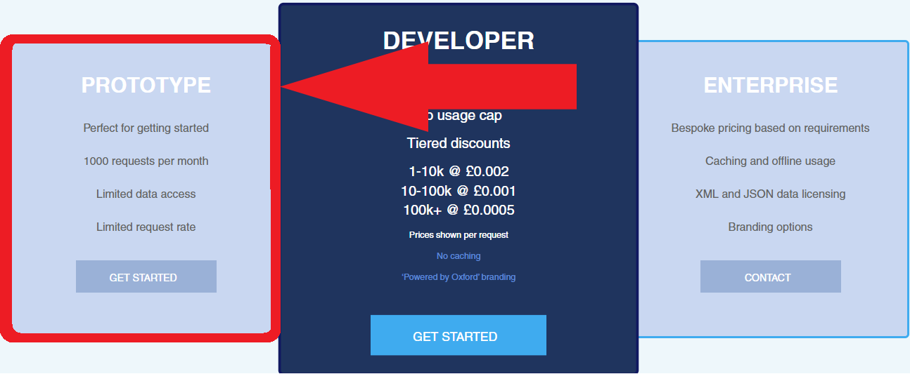
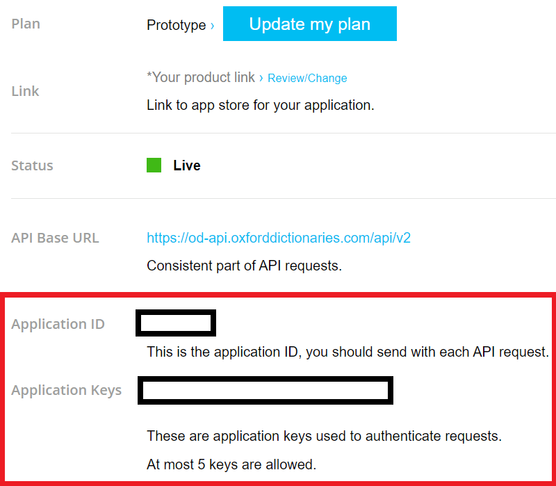
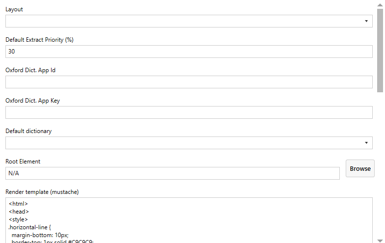

## Dictionary

### Setup

You need to set up an oxford dictionary developer account.

1. Navigate to the [developer website](https://developer.oxforddictionaries.com/) of Oxford Dictionaries
2. Click on **Get your API key** to register an account. Choose the **PROTOTYPE** plan (free)

3. Sign into your account and click on the <kbd>CREDENTIALS</kbd> button on the home page
4. On credential page, under the **Name** column, click on <kbd>[your app's name]</kbd>
5. Locate `Application ID` and `Application keys` [at the bottom of page ](content/images/plugin-dictionary/dictionary-signup-dev-account-credentials.png ':ignore @tooltip-preview')
5. Open the [Dictionary settings](#settings) and paste these values in `Oxford Dict. App ID` and `Oxford Dict. App Key`

### Using the Dictionary

In SuperMemo, select a word in your html component, and press <kbd>Ctrl</kbd> + <kbd>Alt</kbd> + <kbd>D</kbd>. A window will open with the definition for your word. Press <kbd>Extract</kbd> to extract the definition to your collection.

> [!NOTE]
> - You can choose where your definition extracts will be placed in your Knowledge tree by changing the **Root element** in the [settings](#settings).
> - You can change the default language by setting the **Default dictionary** in the [settings](#settings).
> - The dictionary is also available inside the [PDF plugin](plugin-pdf#pdf-dictionary).

### Extract template

You can change the format of your definition extracts by changing the **Render template** in the [settings](#settings). The Dictionary uses a template engine called **Mustache**, which allows users to dynamically define how to present a data model.

You can [download an example](content/data/plugin-pdf-oxford-dictionaries-model.json ':ignore') of the data model in the form of a json object for the word **peace**. However, we recommend that you instead study the [default template](content/data/plugin-pdf-default-template.txt ':ignore') if you wish to create your own.

### Settings

To access the **Dictionary settings**, either:
  - <kbd>Right click</kbd> the  icon in your Window tray bar, and click on the <kbd>Dictionary</kbd> menu item
  - Press <kbd>Ctrl</kbd> + <kbd>Alt</kbd> + <kbd>Shift</kbd> + <kbd>O</kbd> and click on the cog  icon next to the Dictionary plugin

### FAQ

Q: Is credit card required?

A: credit card is not required for prototype account, if it is asked you chose the wrong option in step 2PDF
