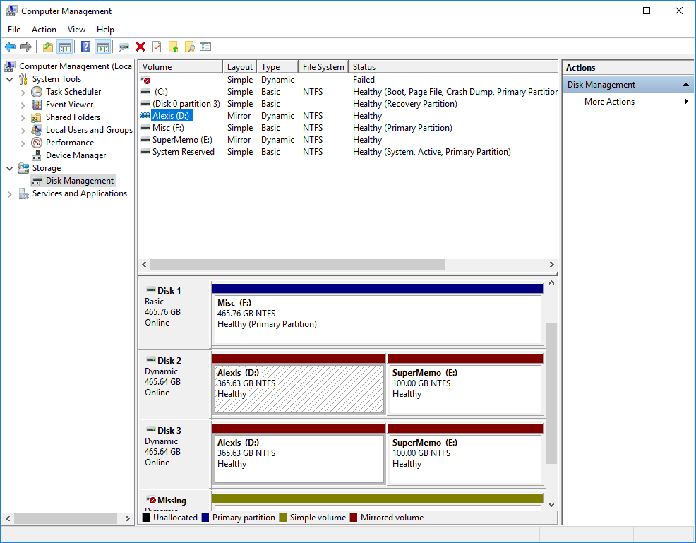
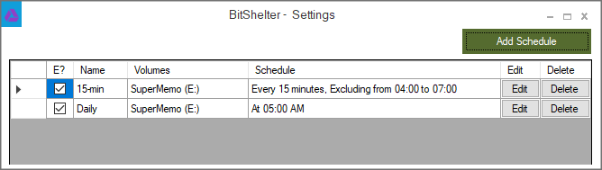
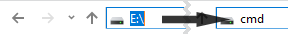
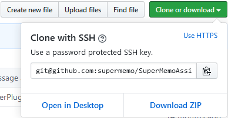
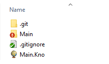

## Why & How ?

#### Why should you backup ?

!> ⚠️ **Your collection is precious**. If you are using SuperMemo, you will likely be pouring days, weeks or months of your life in building it. Don't let it all go to waste. **Having frequent backups is vital**.

Do you care about your health ? Would you take a gamble on your life and forfeit your health insurance ? If your answer is no, then keep reading.

Computer glitches can happen at any time. It is precisely because we cannot anticipate them, that we take measures to mitigate their potential damage.

?> *Still not convinced* ? [Read testimonies](#testimonies) from SuperMemo users who remained skeptic, until it was too late.

#### Proposed strategy

The strategy that we suggest attempts to strike a **balance between robustness and ease of use**. This is not a foolproof method, but it should be robust enough that you do not lose more than a single session of SuperMemo.

?> As importantly, it shouldn't take you more than **a few seconds** to commit your hard work to **safety**.

We are going to implement two layers of safety:
1. *Local backups*: Frequent (15 minutes), cheap (disk size), without interruption (you can use SuperMemo concurrently).
2. *Internet backups*: On-demand (after every session), long-term storage (unlimited).

As of the moment of writing this guide (2020/02), this solution is **free** (as in free beer, and in freedom). As an added bonus, you will also be able to **synchronize your collection** between computers.

## Step-by-step guide

### Local backups: BitShelter

[BitShelter](https://github.com/alexis-/BitShelter) *(a.k.a. SuperMemo Backup)* is a software that keeps a version history of your files. It is similar to the Ctrl+Z feature of text editors, only for files.

##### I) (*Optional*) Create a partition for your SuperMemo collections

For easier management of your files, and to save space for the frequent snapshots (more on these later), we recommend creating a partition dedicated to your SuperMemo collection.

?> If you don't know how to create a partition in Windows, you can [follow this guide](https://www.tomshardware.com/news/how-to-make-partitions-windows-10,36643.html).

You should obtain a layout similar to this one (it is fine if you only have one disk, instead of two as in this example):

##### II) Install & Configuration

###### Installing BitShelter

1. Download and install [the latest version](https://github.com/alexis-/BitShelter/releases) of *BitShelter*
2. Start **BitShelter Agent** from the Windows Start menu
3. Double-click on the [**Tray Icon**](https://github.com/alexis-/BitShelter/raw/master/Resources/BitShelter.Agent_TrayIcon.png): 

###### Enabling Windows' Volume Snapshot Service (VSS)

> Take note of the Drive Letter which contains your SuperMemo collection. If you only have one disk in your computer, it should be C:\\

?> **In this example, the SuperMemo collection Drive Letter is E:\**

1. In the [Main Window](https://raw.githubusercontent.com/alexis-/BitShelter/master/Resources/BitShelter.Agent_Rules.png), click on the <kbd>**Add Schedule**</kbd> button
2. Click on <kbd>**Enable other Drive(s)**</kbd> in the [General tab](https://github.com/alexis-/BitShelter/raw/master/Resources/BitShelter.Agent_General.png)
3. Select the SuperMemo drive **(E:\\)** in the [System Protection dialog](https://github.com/alexis-/BitShelter/raw/master/Resources/SystemPropertiesProtection_2018-05-05_13-10-18.png) and click on <kbd>**Configure**</kbd>
4. In the [new dialog](https://github.com/alexis-/BitShelter/raw/master/Resources/SystemPropertiesProtection_2018-05-05_13-10-22.png) click on <kbd>**Turn on protection**</kbd>, select at least 2GB of desired reserved space(\*) for Snapshots, then press <kbd>**OK**</kbd>
5. Back in the [General tab](https://github.com/alexis-/BitShelter/raw/master/Resources/BitShelter.Agent_General.png), click on <kbd>**Raise limit**</kbd>, and set the new limit to **512**

\*: *If you chose not to create a partition dedicated to SuperMemo, the reserved space will be used up by all the other modifications written to your partition. You should consequently increase the reserved space.*

###### Creating snapshot rules in BitShelter

1. Frequent snapshots (15 min)
  1. Click on the <kbd>**Add Schedule**</kbd> button
    * Select the SuperMemo **Drive letter (E:\\)**
    * Set **Lifetime** to *1 Day*
  2. Click on the <kbd>**Schedule**</kbd> **tab** and fill [the following values](content/images/backup-setup/bitshelter-15min-schedule.png ':ignore')
    * **Occurs every**: *15 minutes*
	* **Frequency**: *Daily*
	* **Recurs every**: *1 day(s)*
	* **End on**: *Never*
  3. Press the **Create** button
2. Daily snapshots
  1. Click on the <kbd>**Add Schedule**</kbd> button
    * Select the SuperMemo **Drive letter (E:\\)**
    * Set **Lifetime** to *6 Month*
  2. Click on the <kbd>**Schedule**</kbd> **tab** and fill [the following values](content/images/backup-setup/bitshelter-daily-schedule.png ':ignore')
    * **Occurs once at**: *08::00::00 (or whenever your computer is running)*
	* **Frequency**: *Daily*
	* **Recurs every**: *1 day(s)*
	* **End on**: *Never*
  3. Press the **Create** button

#### You are done... Almost !

!> It is highly recommended that you **make sure everything is working as intended**. [Verify the snapshots](https://www.howtogeek.com/howto/11130/restore-previous-versions-of-files-in-every-edition-of-windows-7/) are properly created on your SuperMemo Drive **(E:\\)**

Your BitShelter settings should look similar to the following configuration:

#### Oh no. Something happened to my Collection. How to save the day ?

Don't panic ! Follow [this guide](https://www.howtogeek.com/howto/11130/restore-previous-versions-of-files-in-every-edition-of-windows-7/) to restore your collection to an earlier version.

### Internet backups: Git & Github

#### Git 101

?> **Git** is a tool that makes it easier to track changes to files. When you edit a file, git can help you determine exactly *what* changed, *who* changed it, and *why*.   It is useful for coordinating work among multiple people on a project, and for tracking progress over time by saving “checkpoints”. You could use it while writing an essay, or to track changes to artwork and design files. [\[1\]](https://hackernoon.com/understanding-git-fcffd87c15a3)

For our purpose, **git** will be our mean to:
- Create versions of our collection (*\"restore points\"*).
- Upload our work to a safe\*, remote place.
- *(Bonus)* Synchronize our work between devices.

\*: *Although GitHub can be considered fairly reliable, we highly recommend that you implement a solution to encrypt your collection. This is, after all, a way to your most inner thoughts.*

#### Installing & Setting up Git with GitHub

?> **In this example, the GitHub repository name will be named SuperMemo-Collection**

1. Create a [GitHub account](https://github.com/join/)
2. [Follow this guide](https://vladmihalcea.com/tutorials/git/windows-git-ssh-authentication-to-github/) to:
  - Install Git
  - Setup a SSH key that automatically authenticate your Git installation with your GitHub account
  
#### Creating & Synchronizing your GitHub repository

1. Create a [new repository](https://github.com/new)
  - Give a name to your new repo (e.g. *SuperMemo-Collection*)
  - Select **Private**
2. In your SuperMemo Drive (**E:\\**), open a command prompt: type `cmd.exe`, then press <kbd>Enter</kbd>

3. Go to your **GitHub repository** web page, click the <kbd>**Clone or download**</kbd> button, and copy the link.

4. In the **command prompt**, type `git clone <git@github.com:......>`. Replace the text between **< >** with the link you copied from GitHub.
5. Your repository is now synchronized with your computer. Copy your SuperMemo collection in the new folder. Your folder should look similar to the example below (*.gitignore* might be missing):

6. [Download this .bat file](content/data/sm-main-commit.bat ':ignore') and save it in your local repository folder (where your `.git` directory is located). It contains the following commands:

[sm-main-commit.bat](content/data/sm-main-commit.bat ':include')

7. Run `sm-main-commit.bat` (double click). If all went well, your should be able to see your collection on your GitHub repository web page.

#### Pushing (*\"saving\"*) your work to GitHub

!> Every time you finish using SuperMemo, make sure to run `sm-main-commit.bat`.

That's all ! Your collection is synchronized online, congratulations !

## Suggestions to improve your backup strategy

> Work in progress. Come back later !

- 1-2-3 backup rule
- RAID 0

## Testimonies

> 💬 **Luke Avedon**: “*Back up your collection.  I'm ashamed to admit I used to never back up my collection.  Once while running a quick, 'repair collection' I lost power.  An entire section of my knowledge tree was mangled forever.  All the references changed to strange, incomprehensible characters.  Now I know better.  I automatically back up to two local hard drives, and three cloud drives each day.*”

> 💬 **Nour**: “*Well, I'm a bit new to SM and although I was warned, I did not understand the gravity of the warnings. Back-up your collection. Since I'm new, I don't understand a lot of the issues, but I know I didn't do anything to provoke them, and yet the combination of SM and my virtual machine had corrupted and misplaced files and needed to be repaired – with the repairs yielding some unwanted adjustments to my collection. Of course, if all your final prep is on SM, you'd be having heart palpitations at the thought of your collection getting messed up, I know I was. Sufficed to say lesson learned. The hard way, but learned never-the-less.*”
