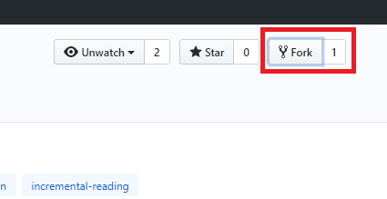
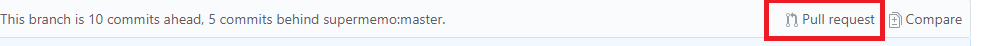
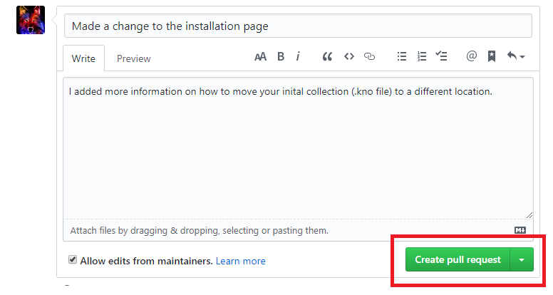

# How to edit SuperMemo.wiki

### Requirements

#### Validate with us the changes you want to apply

Make sure that you either:
- Edit the wiki to address an issue that has already been accepted,
- Open an issue **beforehand** to validate with us the nature and the reasons for the changes you want to apply.

#### Technical requirements

The minimum requirement is an account on [GitHub](https://github.com/) in order to send us your changes to the wiki.

### Setup

#### Forking the Documentation

After logging in to your GitHub account:
1. Visit the [official wiki repository](https://github.com/supermemo/Documentation). This repository contains the documentation for both [SuperMemo](https://www.supermemo.wiki) and [SuperMemo Assistant](https://www.supermemo.wiki/sma).
2. Click on the Fork button at the top right of your screen. This will create create a new, personal version of the repository on your account.

> [!NOTE]
> Your repository should be available at github.com/**YourUsername**/Documentation/, provided you didn't change the name of the repository.

#### Setting up Docsify on your computer

If your edit is simple and less than a few paragraphs worth, you may skip this step. In this case, go to [Editing on GitHub](#on-github).

⚠️ This section is a work in progress.

### Editing the wiki

#### On GitHub

##### Editing the wiki on GitHub

!> Only edit on GitHub if your edit **really is** minor. For larger modifications, we require that you set up a local version of the documentation on your computer. This enables you to validate the visual result of your changes on the website, in real-time.

1. On GitHub, navigate to your forked repository, and select the `docs` folder. 

2. Find the file you want to edit. For example, if you are looking to edit the installation page, you would select the `qs-installation.md` page.

> [!TIP]
> - To know which page a specific part of the wiki belongs to, navigate to wiki and look for the name of the file in your browser's url (e.g. the backup setup page's url is `https://supermemo.wiki/sma/#/qs-backup-setup`, and its file name is `qs-backup-setup.md`.
> - To find a page on GitHub, use <kbd>Ctrl</kbd> + <kbd>F</kbd> to open up the search box. Type the name (or a part of the name) of the page and press <kbd>Enter</kbd>.

3. Click the pencil icon to enable the editing mode, and start editing the wiki.

> [!TIP]
> To quickly find the text you want to edit in the page, use <kbd>Ctrl</kbd> + <kbd>F</kbd> to open up the search box.

##### Committing your page edits on GitHub

1. Once you are done with your edits, scroll to the bottom of the webpage and select the <kbd>Commit changes</kbd> button. 

2. Make sure to write a summary of your changes.
3. Once you have verified that your commit message is accurate, proceed with committing directly to the master branch. 
4. Go to your forked repository and click on the <kbd>Pull Request</kbd> tab.

5. Click on the <kbd>New pull request</kbd> button.

6. Add a title and a decription of the changes you made (you may copy parts, or the totality of your commit message).

7. Finally, click the <kbd>Submit pull request</kbd> button. You are done !

We will review your Pull Request as soon as possible. GitHub will notify you by email when your PR has been reviewed for either Approval, Modification or Rejection.

#### In Local (on your computer)

⚠️ This section is a work in progress.

### Notes

- If you want to learn Git, check out [this guide](https://hackernoon.com/understanding-git-fcffd87c15a3) or this [interactive tutorial](https://learngitbranching.js.org/). Git is a valuable skill that is used in many projects and looked for by employers. It could be useful to you as a personal skill to manage your own projects.
- This documentation is based on the [Docsify](https://docsify.js.org/#/) platform. Visit the website if you wish to understand how the documentation website works.

### FAQ

**Q: How do I add pictures to the website?**

A:N/A. Stay tuned, the guide will be updated soon.

**Q: What do I do if my change was rejected?**

A: After reviewing your changes, we will provide one or several reasons for our decision. We may agree to accept another pull request after the issues we have raised are fixed.

