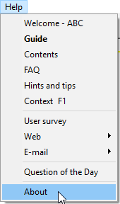
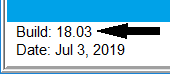

# Installation

### Pre-requisites

#### Supported SM versions

Make sure your current **version of SuperMemo** [is supported](/#supported-versions). To view your current SuperMemo version, from the menu, click on *Help*, then *About*.

#### Dependencies

You will need to install the following tools in order to use SMA:

- [.NET Framework](https://dotnet.microsoft.com/download/dotnet-framework/thank-you/net472-web-installer) (4.7.2) (Installed by default on Windows 10)

### Downloading SMA

SMA releases are published on [our GitHub page](https://github.com/supermemo/SuperMemoAssistant/releases/latest/). You may also build the software from sources.

#### Are there risks ?

!> ⚠️ **Your collection is precious**. If you are using SuperMemo, you will likely be pouring days, weeks or months of your life in building it. Don't let it all go to waste. **Make sure you have a [backup strategy](https://www.supermemo.wiki/backup)**.

We have been extensively testing SMA since 2019. There are no reasons to believe your collection is at risk by using SMA. However, SMA is a very complex piece of software. A rarely occuring bug could be hiding in the code base, or a future release could have unfortunate consequences. Don't take any chances.

### Installing SMA

Simply execute the installer, and wait for the setup to complete. A "SuperMemo Assistant" shortcut will be placed in your start menu.

### Updating from version 2.0.3 to 2.1.0

If you were previously using version 2.0.3 or older, you can migrate your configuration to the new version:

1. In **File Explorer**, navigate to `%UserProfile%\Documents\SuperMemoAssistant`
2. Copy your **Configs** folder
3. Navigate to `%UserProfile%\SuperMemoAssistant` (create the folder if it doesn't exist)
4. Paste the folder

The final path should be: `%UserProfile%\SuperMemoAssistant\Configs` (e.g. `C:\Users\Alexis\SuperMemoAssistant\Configs`).