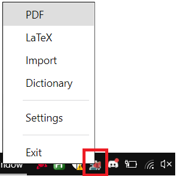

## Accessing the Settings {docsify-ignore}

There are **two means of accessing** the SMA Settings window:

#### Keyboard shortcut

The preferred mean of opening the settings is using the <kbd>Ctrl</kbd> + <kbd>Alt</kbd> + <kbd>Shift</kbd> + <kbd>O</kbd> keyboard shortcut.

#### Tray icon

Another mean of accessing it is to <kbd>Click</kbd> the SMA tray icon:

 

- Clicking any of the **Plugin name** (PDF, LateX, etc.) will open the related Plugin settings dialog,
- Clicking on **Settings** will the settings window for SMA.