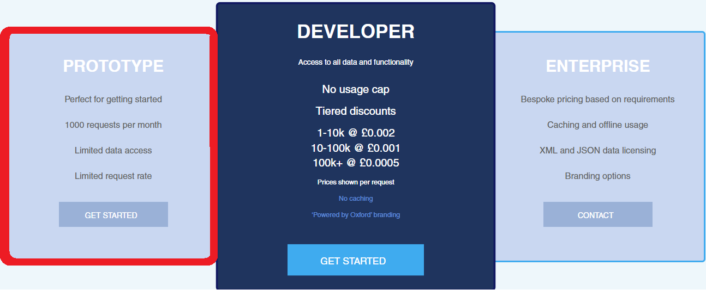

## Dictionary

### In SM

CTRL+ALT+D to open Dictionary

### In PDF

CTRL+D to open dictionary

### Setup

You need to set up an oxford dictionary developer account.

1. https://developer.oxforddictionaries.com/

2. Get your api key -> Choose the option "PROTOTYPE" on the left

After the account is made and you are signed in, clickCREDENTIALSin the home page.

4. In credentials click "<u>[yourname]'s app</u>" and locate(1) application ID  (2) Application keys, *(the image below)*

5. After you located these values, go to dictionary settings in SMA *(you can access it by rightclicking SMA icon in windows toolbar)*

6. In dictionary settings: Write values in "Oxford Dict. App ID" and Oxford Dict. App Key *(app key is the longer one)*

### FAQ

Q: Is credit card required?

A: credit card is not required for prototype account, if it is asked you chose the wrong option in step 2PDF
