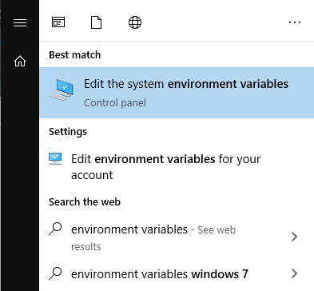
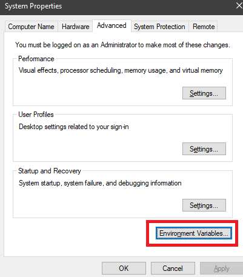
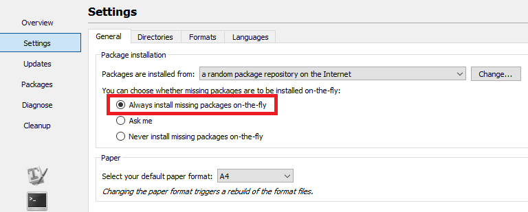
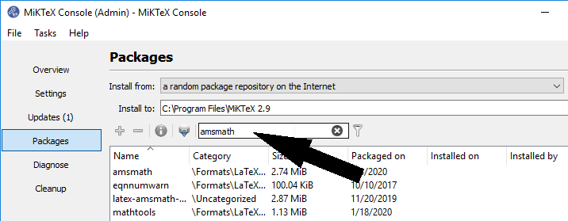
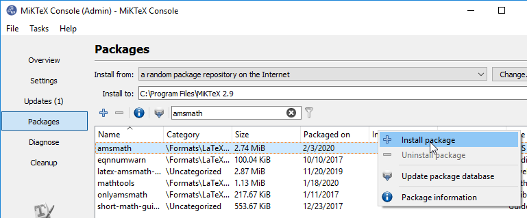
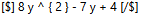
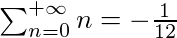
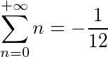
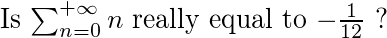

# LaTeX & OCR

## Video tutorial

  <iframe src="https://www.youtube.com/embed/ctgnQjTEQnw?start=622" class="youtube-video" frameborder="0" allowfullscreen></iframe>

## LaTeX: Setup

1. [Download MiKTeK](https://miktex.org/download)
2. ⚠️ <u>**Install with these options**</u>: ⚠️
	1. Install MiKTeX for anyone who uses this computer (all users)
	2. Install missing packages on-the-fly: Yes

3. Add the MiKTeX `bin` folder to your `PATH` environment variables
  1. Search *environment variables* in [windows start menu ](# '@tooltip-preview') 🖼️ and click on <kbd>Edit system environment variables</kbd>
  
  2. In the **System Properties** window, click on [<kbd>Environment Variables</kbd> ](# '@tooltip-preview') 🖼️
  
  3. Under **System variables**, find variable called *Path* and click *Edit*. Click on <kbd>New</kbd> and insert the path for your MiKTeK `bin` folder (usually `C:\Program Files\MikTeX 2.9\miktex\bin\64\`)
   

4. Open settings in **MiKTeX console** and:

  1. Make sure the packages can be [downloaded on the fly ](content/images/plugin-LaTeX/MiKTeX/miktex-onfly.png ':ignore @tooltip-preview')
  
  2. In the <kbd>Directories</kbd>, make sure your configuration looks [like this ](content/images/plugin-LaTeX/MiKTeX/miktex-directories.png ':ignore @tooltip-preview')
  
  3. Go to the <kbd>Packages</kbd> tab, and install the following packages: `zhmetrics`, `amsmath`.
    1. Select [the search box ](content/images/plugin-LaTeX/MiKTeX/miktex-packages-search.png ':ignore @tooltip-preview') and type the name of the package
    2. <kbd>Right click</kbd> on [the line ](content/images/plugin-LaTeX/MiKTeX/miktex-packages-install.png ':ignore @tooltip-preview') that matches the package name, and click on <kbd>Install package</kbd>

Once this is done, you are ready to use LaTeX.

## LaTeX basics

### Generating images from LaTeX and back in SuperMemo

In SuperMemo Assistant, TeX formulas are enclosed between tags:

Once your formula has been correctly formatted, press <kbd>Ctrl</kbd> + <kbd>Alt</kbd> + <kbd>L</kbd> to generate an image:

$ 8 y ^ { 2 } - 7 y + 4 $

To revert the process, press <kbd>Ctrl</kbd> + <kbd>Alt</kbd> + <kbd>Shift</kbd> + <kbd>L</kbd>. This will turn images back into editable TeX code.

<video controls>
  <source src="content/videos/plugin-latex/latex-complex-extract-result.webm" type="video/webm; codecs=vp9">
  <source src="content/videos/plugin-latex/latex-complex-extract-result.mp4" type="video/mp4">
  
Your browser doesn't support HTML5 video. Here is a <a href="content/videos/plugin-latex/latex-complex-extract-result.mp4">link to the video</a> instead.

</video>
  

> [!NOTE]
> - You can integrate text with LateX. This is useful especially when these two are in-line together.
> - Images are embedded in your HTML elements, and will display even without SMA or an internet connection.

### Default tags (render modes)

By default, SMA implements three tags you can choose from:

##### Inline TeX formula

`[$]\sum^{+\infty}_{n = 0} n = -\frac{1}{12}[/$]` yields:

##### Large TeX formula

`[$$]\sum^{+\infty}_{n = 0} n = -\frac{1}{12}[/$$]` yields:

##### LaTeX document

`[latex]Is \begin{math}\sum^{+\infty}_{n = 0} n \end{math} really equal to $ -\frac{1}{12} $ ?[/latex]` yields:

