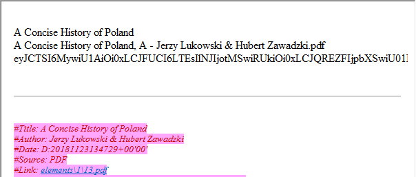
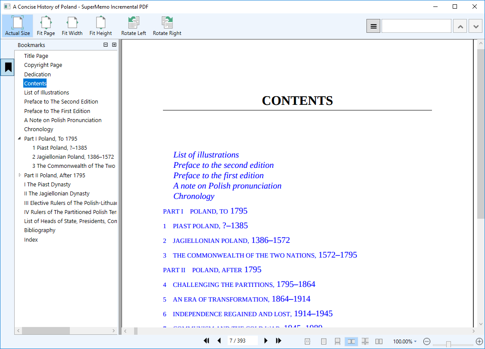

This article features guides for how to work with PDFs in SuperMemo using SMA.

### PDF: Video tutorial

Here’s a video tutorial summarizing the basics.

  <iframe src="https://www.youtube.com/embed/bZ-F7v_wWg8?start=622" class="youtube-video" frameborder="0" allowfullscreen></iframe>

### 1.1 PDF: Importing
The first step of using a PDF with SMA is to import it. 

#### Prerequisite:
 - SuperMemo must have the keyboard focus. To make sure that SuperMemo has the keyboard focus, select any window in SuperMemo.

#### To import a PDF:
1. Open the File Picker dialog by pressing Ctrl+Alt+I.
2. Navigate to and select a PDF file.
3. Click Open.

#### Result:
 - The chosen PDF is imported into the binary registry in SuperMemo.
 - A PDF Element is created under the hook of the current concept.
 - The PDF element is opened in the element window.
 

 - The PDF is opened in SMA’s PDF window.
 
#### Video: 

#### Notes:
 - The File Picker dialog sometimes appears in the background, so if the File Picker dialog does not appear, try locating it by using Alt + Tab.
 - Optionally, before importing the PDF, change the location in the knowledge tree at which the PDF element is created by changing the current concept.

!> If you cannot find the File Picker Dialog, use <kbd>Alt</kbd> + <kbd>Tab</kbd> to find a window called **"Open"**. It might sometime open in the background.

> [!NOTE|style:flat]
> A **new element** will be created **in SuperMemo** for you. You can recognize <dfn aria-label="Element in SuperMemo which contains the data of an imported PDF.">[**PDF elements**](#glossary)</dfn> by their content, see below:

### 1.2 PDF: Deleting

SMA stores PDFs in the binary registry, and the procedure for deleting a PDF is the same as that of any registry member in SuperMemo.

#### To delete a PDF:
1. Open the Binary registry, in Search > Other registries > Binary
2. Right-click on the PDF, and choose Delete.

#### Notes:
 - If you have many registry members in the Binary registry, it might be helpful to quickly locate the PDF by typing its title of the PDF in the search bar.
 - Deleting a PDF Element will NOT delete the PDF from the Binary registry.

### 1.3 PDF: Opening and Closing

SMA automatically opens and closes the PDF window upon opening the PDF element in the element window.

SMA opens PDFs in a dedicated window, called the PDF window, displayed below.

?> To **start working** with one of your PDF, navigate to the <dfn aria-label="Element in SuperMemo which contains the data of an imported PDF.">**PDF element**</dfn> that was created in SuperMemo. The <dfn aria-label="The window that displays the actual PDF, and where extracts can be created.">[PDF window](#glossary)</dfn> will be opened.
> [!NOTE]
> To **close** the PDF, either **close the Window** as you normally would, or **navigate to another element**.
