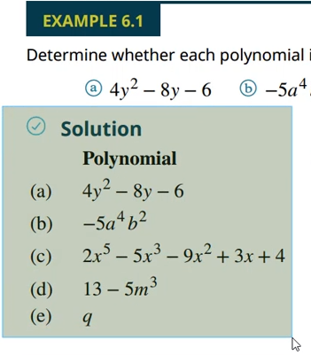
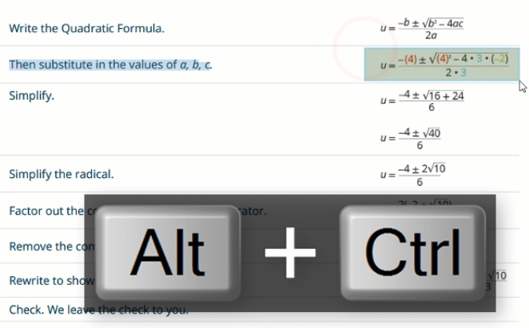
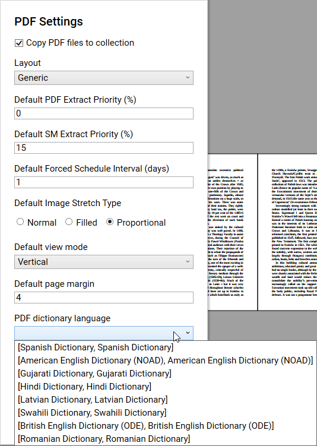
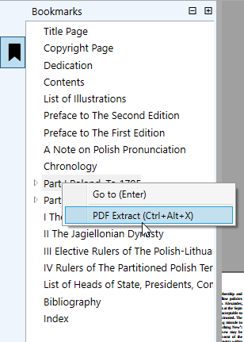
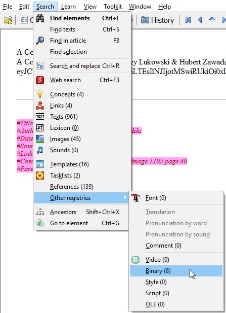

# PDF

[plugin-pdf-common.md](plugin-pdf-common.md ':include')

### PDF: Force selection

When you have PDF made of images only, or when you find it hard to select the image (interference with text) you can use force selection by holding <kbd>Right click</kbd>. This will ignore text selection.

You can use <dfn aria-label="Selection mode that ignores text or image under the cursor. Hold Right click and drag to use.">force selection</dfn> with OCR as shown in the video clip below. (See [built-in OCR](#pdf-built-in-ocr))

<video controls>
  <source src="content/videos/plugin-pdf/pdf-extract-image-forceselection.webm" type="video/webm; codecs=vp9">
  <source src="content/videos/plugin-pdf/pdf-extract-image-forceselection.mp4" type="video/mp4">
  <p>Your browser doesn't support HTML5 video. Use this <a href="content/videos/plugin-pdf/pdf-extract-image-forceselection.mp4">link to the video</a> instead.</p>
</video>

### PDF: Built-in OCR

The PDF plugin implements an optional **OCR**, working with both **text** and **scientific formulas** (math, chemestry, ...). Make sure that you also configure the [LaTeX plugin](plugin-LaTeX).

#### Setup

Behind the scene, SMA uses [MathPix](https://www.mathpix.com/) to recognize images. [Register](https://dashboard.mathpix.com/) an account to unlock the OCR feature. At the day of writing this guide, pricing is free up to 1000 requests.

Once you are registered, copy your **MathPix App Name** and **Key** and paste them in the [PDF plugin settings](#).

<div class="pure-g">
  <div class="pure-u-1-3" style="padding-right: 30px;">
    
  </div>
  <div class="pure-u-2-3">
    
  </div>
</div>

#### Using the OCR

1. In the **PDF window**, press the <kbd>Alt</kbd> key, then capture an <dfn aria-label="Image selection mode which captures a region of your PDF into an image. Hold left or right click, then drag an area with your mouse.">[area snapshot](#extract-images)</dfn>.
2. If your image was success recognized, a window titled *TeX editor* will display your result.


> [!TIP|style:flat]
> - MathPix works with [complex content ](# '@tooltip-preview @z2v="content/videos/plugin-pdf/pdf-ocr-complex-extract"') 📽️
> - [OCR can be used ](# '@tooltip-preview @z2v="content/videos/plugin-pdf/pdf-ocr-multi-selection"') 📽️ in <dfn aria-label="Selection that contains more than one object (text, image, area snapshot, OCR). Types of objects can be mixed and matched. To start a multi-selection, **hold** the Ctrl key, and select your content.">[multi-selection](#multi-selection)</dfn>
<!-- ':) -->

#### In-line formulas

If your PDF has formulas in-line with text you want to extract, the easiest way to select your area snapshot is to use <dfn aria-label="Selection mode that ignores text or image under the cursor. Hold Right click and drag to use.">[force selection](#pdf-force-selection)</dfn>.

<video style="margin: auto auto;" controls>
  <source src="content/videos/plugin-pdf/pdf-ocr-wholeline.webm" type="video/webm; codecs=vp9">
  <source src="content/videos/plugin-pdf/pdf-ocr-wholeline.mp4" type="video/mp4">
  <p>Your browser doesn't support HTML5 video. Here is a <a href="content/videos/plugin-latex/pdf-ocr-wholeline.mp4">link to the video</a> instead.</p>
</video>

### PDF: Dictionary

The PDF plugins implements an optional **dictionary**. Make sure to [setup the dictionary plugin](plugin-dictionary#setup).

Select a word and press <kbd>Ctrl</kbd> + <kbd>D</kbd>. A popup will be displayed [next to the word ](content/images/plugin-pdf/pdf-dictionary-popup.png ':ignore @tooltip-preview').

#### Per-PDF dictionary language

You can change the dictionary language for each of your PDF. In the <dfn aria-label="The window that displays the actual PDF, and where extracts can be created.">PDF window</dfn>, press <kbd>Ctrl</kbd> + <kbd>O</kbd> and [select a language ](pdf-settings-dictionary-languages.png ':ignore @tooltip-preview') from the *PDF dictionary language* combo box.

### PDF: Sub-PDF

Sub-PDFs (a.k.a. *PDF extracts*) are <dfn aria-label="Element in SuperMemo which contains the data of an imported PDF.">[PDF elements](#glossary)</dfn> which contain only a part of your original PDF. Sub-PDFs are useful when you want to focus on specific chapters, or work simultaneously on several chapters.

?> Sub-PDFs are a way of **splitting PDFs** into separate pieces.

> [!NOTE|style:flat]
> Sub-PDFs are indicated by colored highlights and overlays, as illustrated below:


#### Sub-PDF: Using bookmarks

If your PDF has **bookmarks**, access them by clicking the bookmark icon , or by pressing <kbd>Ctrl</kbd> + <kbd>B</kbd>. Then, select the chapter you want to extract and either:
- <kbd>Right click</kbd> on it, and then select [<kbd>PDF extract</kbd> 🖼️ ](# '@tooltip-preview')
- Press <kbd>Ctrl</kbd> + <kbd>Alt</kbd> + <kbd>X</kbd>

#### Sub-PDF: Manual selection

There are two ways to manually create sub-PDFs:

1. **Text selection**: Select the desired text normally, then press <kbd>Ctrl</kbd> + <kbd>Shift</kbd> + <kbd>X</kbd>
2. **Page selection** *(see video below)*
  1. <kbd>Double click</kbd> an area of the page that is neither text nor image (the page will turn blue)
  2. Scroll to the last page you want to include in the section, then <kbd>Shift</kbd> + <kbd>Left click</kbd> on an area of the page that is neither text nor image
  3. Press <kbd>Ctrl</kbd> + <kbd>Shift</kbd> + <kbd>X</kbd>

<video controls>
  <source src="content/videos/plugin-pdf/pdf-manualsub.webm" type="video/webm; codecs=vp9">
  <source src="content/videos/plugin-pdf/pdf-manualsub.mp4" type="video/mp4">
  <p>Your browser doesn't support HTML5 video. Here is a <a href="content/videos/plugin-pdf/pdf-manualsub.mp4">link to the video</a> instead.</p>
</video>

## PDF: Settings

There are two layers of settings available:

- **Global PDF settings**: To access these settings, either
  - <kbd>Right click</kbd> the  icon in your Window tray bar, and click on the <kbd>PDF</kbd> menu item
  - Press <kbd>Ctrl</kbd> + <kbd>Alt</kbd> + <kbd>Shift</kbd> + <kbd>O</kbd> and click on the cog  icon next to the PDF plugin
  
- **Per-PDF settings**: In the <dfn aria-label="The window that displays the actual PDF, and where extracts can be created.">PDF window</dfn>, press <kbd>Ctrl</kbd> + <kbd>O</kbd> to bring up [settings dialog ](content/images/plugin-pdf/pdf-per-pdf-settings.png ':ignore @tooltip-preview').

> [!NOTE]
> Per-PDF settings will override the global settings.

## PDF: Deletion

Your PDFs are stored in your collection elements. They are inserted in SuperMemo's binary registry. To remove a PDF file, follow this procedure:
1. [In the menu ](# '@tooltip-preview') 🖼️ click on <kbd>Search</kbd>, then <kbd>Other registries</kbd>, and then on <kbd>Binary</kbd>
2. Find your PDF in the **Binary registry** window, then <kbd>Right click</kbd> on it, and select <kbd>Delete</kbd>

!> If you delete a <dfn aria-label="Element in SuperMemo which contains the data of an imported PDF.">[PDF element](#glossary)</dfn> from your knowledge tree, it will neither delete the PDF file nor the entry in the Binary registry.

## PDF: Hotkeys

```
HotKeys
			- Bookmark PDF-extract (Ctrl+Alt+X)
			- Manual PDF-extract (Ctrl+Shift+X)
			- SM extract (Alt+X)
			- Mark text as ignored (Ctrl+Shift+I)
			- Show selected text in Dictionary (Ctrl+D)
			- Go To Page (Ctrl+G)
			- SM Learn (Ctrl+L)
			- SM Review All (Ctrl+Shift+L)
			- SM Reschedule (Ctrl+J)
			- SM LaterToday (Ctrl+Shift+J)
			- SM Done (Ctrl+Shift+Enter)
			- SM Delete (Ctrl+Shift+Del)
			- SM Previous (Alt+Left)
			- SM Next (Alt+Right)
			- SM Parent (Ctrl+Alt+Up)
			- SM Child (Ctrl+Alt+Down)
			- SM Prev Sibling (Ctrl+Alt+Left)
			- SM Next Sibling (Ctrl+Alt+Right)
			- UI Show Options (Ctrl+O)
			- UI Toggle Bookmarks (Ctrl+B)
			- UI Focus Viewer (Alt+C)
			- UI Focus Bookmarks (Alt+B)
```


```
Non-hotkeys
			- OCR (Alt+Click)
			- Image area selection (Hold left click)
			- Force image area selection (Hold right click)
			- Zoom (Ctrl+Wheel)
			- Extend text selection (Shift+Click, Shift+Left/Right)
			- Deselect (Escape)
			- PDF navigation (Up/Down/Left/Right/Pg. Down/Pg. Up/Home/End)
			- Select word (Double click)
			- Select paragraph (Triple click)
			- Select page text (Quadra click)
			- Select page (double click on empty space in page)
			- Extend page selection (Shift+Click page)
			- Add to selection (Hold ctrl)
			- Select image (Click image)
```
> [!NOTE]
> When you extract text from the PDF file, the windows error sound may play. You can [disable it by switching off system sounds](#faq).

## Glossary

[plugin-pdf-glossary.md](plugin-pdf-glossary.md ':include')

## FAQ

**Q: Concept verification error: hook is not a child of root!**

A: Change currently activated concept as the one with hook in it for the PDFs.

**Q: PDFs stop working after repair of SM collection**

A: This is because when you do repair, SM restarts itself, while SMA doesn't. So the solution is to restart SMA manually.

**Q: When i click PDF the whole page is selected as an image**

A: Your PDF is made of images, force image area selection by holding right click to OCR the text with SMA. Another way is to use external OCR software to turn the PDF into editable text. See [Working with images](#pdf-force-selection).

**Q: My PDF won't load and there is an error in the logs**

A: Create an [issue ticket on github](https://github.com/supermemo/SuperMemoAssistant.Plugins.PDF/issues) and upload your logs and your PDF file.

**Q: How to I jump to a specific page number ?**

A: Use <kbd>Ctrl</kbd> + <kbd>G</kbd>.

**Q:How do I disable the Windows Sound from playing when I extract from a PDF?**

A: In order to stop the sound from playing, you can right click the volume icon on the taskbar, then open the volume mixer and set system sounds to zero. 
