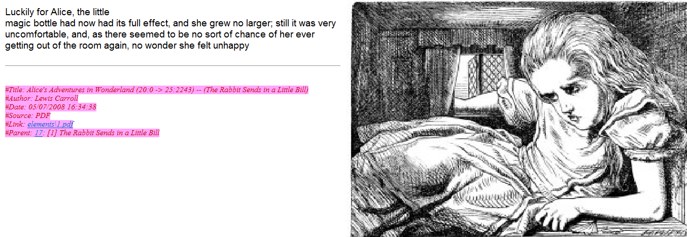

# PDF

## How to import PDF?

Make sure SMA & SuperMemo both are [running](qs-using-sma.md)

1. Press <kbd>CTRL+ALT+I</kbd> to import PDF
2. File explorer window for PDF should open. *(If it doesn't, check <kbd>ALT+TAB</kbd> for window called "Open")*


<!-- 

 **Optional: Hook:**
PDFs will appear under your currently activated concept *(in the image "Reading")* If you want control over where PDFs will appear,  you can change the concept's hook by clicking icon shown in the image or <kbd>Right click  -> Concept -> Set hook</kbd>.-->


## How to open PDF in SM?

 PDF will open **when you select the topic** SMA created for you (on import). When unselected the PDF will close. The topic holds metadata of PDF and will look something like this:

 

## How to make extracts in PDF?

### Basic functions

1. Select text or image

2. Alt+X *(hold CTRL if you want both text & image)*

     

<video width="400" height="280" controls>
<source src="content/videos/plugin-PDF/pdf-text-and-image.webm" type="video/webm; codecs=vp9">
<source src="content/videos/plugin-PDF/pdf-text-and-image.mp4" type="video/mp4">
<p>Your browser doesn't support HTML5 video. Here is a <a href="content/videos/plugin-PDF/pdf-text-and-image.mp4">link to the video</a> instead.</p>
</video> 

This is an example of what an image + text extract looks like in SuperMemo




### Force selection

When you have PDF made of images only or you find it hard to select the image (interference with text) you can use force selection by holding <kbd>right mouse button</kbd>. This will ignore text selection.

If your PDF is made of only images and you want to extract text, you can use force selection (right click) with OCR as shown in the GIF below. (See [OCR installation](https://supermemo.wiki/sma/#/plugins-LaTeX?id=latex-amp-ocr))

<video width="600" height="340" controls>
<source src="content/videos/plugin-PDF/pdf-image-forceselection.webm" type="video/webm; codecs=vp9">
<source src="content/videos/plugin-PDF/pdf-image-forceselection.mp4" type="video/mp4">
<p>Your browser doesn't support HTML5 video. Here is a <a href="content/videos/plugin-PDF/pdf-image-forceselection.webm">link to the video</a> instead.</p>
</video>

### Inline LateX

If your PDF has LateX equations inline with text you want to extract, you can tackle this by simply including them both in OCR. Either by <kbd>ALT+LEFT CLICK</kbd> or if something is interfering with your selection, then <kbd>ALT+RIGHT CLICK</kbd> (force selection) as shown in the GIF below.

<video width="600" height="360" controls>
<source src="content/videos/plugin-latex/latex-ocr-wholeline.webm" type="video/webm; codecs=vp9">
<source src="content/videos/plugin-latex/latex-ocr-wholeline.mp4" type="video/mp4">
<p>Your browser doesn't support HTML5 video. Here is a <a href="content/videos/plugin-latex/latex-ocr-wholeline.mp4">link to the video</a> instead.</p>
</video>


## What is SUB-PDF?

Sub-PDFs are basically mirrors of your original PDF, but with specific section targeted. Sub PDFs are useful when you want to focus on certain chapter, while working separately with rest of the chapters 

> PDF extracts are a way of splitting PDF into seperate pieces

 You can create Sub-PDFs of the original PDF via bookmarks *(if your PDF has these pre-made)* or manual text selection.

**Hotkeys:**

Bookmark extract: <kbd>CTRL+ALT+X</kbd>

Manual PDF-Extract: <kbd>CTRL+SHIFT+X</kbd>

<font size= 4>**Your PDFs will look like this after PDF-extracts**</font>


| Result in Sub-PDF *(extracted sections is focused)*          | Result in the original PDF *(extracted section is marked orange)* |
| :----------------------------------------------------------- | :----------------------------------------------------------- |
|  |  |

### Sub-PDF via bookmarks

If your PDF happens to have pre-made bookmarks you can toggle bookmarks with CTRL+B, select chapter you want to extract and press CTRL+ALT+X.

Or alternatively you can click the bookmark icon  and right click to extract.

### Sub-PDF manually

You can select text like you typically would and press CTRL+SHIFT+X

Another way is double clicking area outside of text to turn page blue, then SHIFT+LEFT CLICK last page you want to include in the section. This prodecure is shown in the GIF below.

<video width="400" height="280" controls>
<source src="content/videos/plugin-PDF/pdf-manualsub.webm" type="video/webm; codecs=vp9">
<source src="content/videos/plugin-PDF/pdf-manualsub.mp4" type="video/mp4">
<p>Your browser doesn't support HTML5 video. Here is a <a href="content/videos/plugin-PDF/pdf-manualsub.mp4">link to the video</a> instead.</p>
</video>


## PDF Deletion

  Your PDFs are held in SM binary, which can be located in SM: Search -> Other registries -> Binary. If you delete topic from knowledge tree, it will not delete it from binary. This you need to do manually after deleting topic if you don't want unnecessary things to make yourcollection sizelarger.

## Hotkeys

```
HotKeys
			- Bookmark PDF-extract (Ctrl+Alt+X)
			- Manual PDF-extract (Ctrl+Shift+X)
			- SM extract (Alt+X)
			- Mark text as ignored (Ctrl+Shift+I)
			- Show selected text in Dictionary (Ctrl+D)
			- Go To Page (Ctrl+G)
			- SM Learn (Ctrl+L)
			- Learn And Reschedule (Ctrl+Shift+L)
			- SM Reschedule (Ctrl+J)
			- SM LaterToday (Ctrl+Shift+J)
			- SM Done (Ctrl+Shift+Enter)
			- SM Delete (Ctrl+Shift+Del)
			- SM Previous (Alt+Left)
			- SM Next (Alt+Right)
			- SM Parent (Ctrl+Alt+Up)
			- SM Child (Ctrl+Alt+Down)
			- SM Prev Sibling (Ctrl+Alt+Left)
			- SM Next Sibling (Ctrl+Alt+Right)
			- UI Show Options (Ctrl+O)
			- UI Toggle Bookmarks (Ctrl+B)
			- UI Focus Viewer (Alt+C)
			- UI Focus Bookmarks (Alt+B)
```


```
Non-hotkeys
			- OCR (Alt+Click)
			- Image area selection (Hold left click)
			- Force image area selection (Hold right click)
			- Zoom (Ctrl+Wheel)
			- Extend text selection (Shift+Click, Shift+Left/Right)
			- Deselect (Escape)
			- PDF navigation (Up/Down/Left/Right/Pg. Down/Pg. Up/Home/End)
			- Select word (Double click)
			- Select paragraph (Triple click)
			- Select page text (Quadra click)
			- Select page (double click on empty space in page)
			- Extend page selection (Shift+Click page)
			- Add to selection (Hold ctrl)
			- Select image (Click image)
```

## FAQ

 **Q: Concept verification error: hook is not a child of root!**

 A: Change currently activated concept as the one with hook in it for the PDFs

 **Q: PDFs stop working after repair of SM collection**

 A: This is because when you do repair, SM restarts itself, while SMA doesn't. So the solution is to restart SMA manually.

**Q: When i click PDF the whole page is selected as an image**

A: Your PDF is made of images, force image area selection by holding right click to OCR the text with SMA. Another way is to use external OCR software to turn the PDF into editable text. See [Working with images](https://sma.supermemo.wiki/#/plugins-PDF?id=working-with-images-and-ocr)

**Q: My PDF won't load and there is an error in the logs**

A: Create an [issue ticket on github](https://github.com/supermemo/SuperMemoAssistant.Plugins.PDF/issues) and upload your PDF