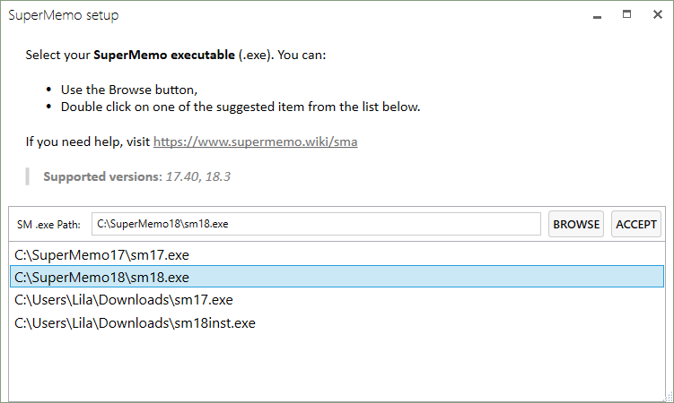
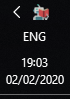
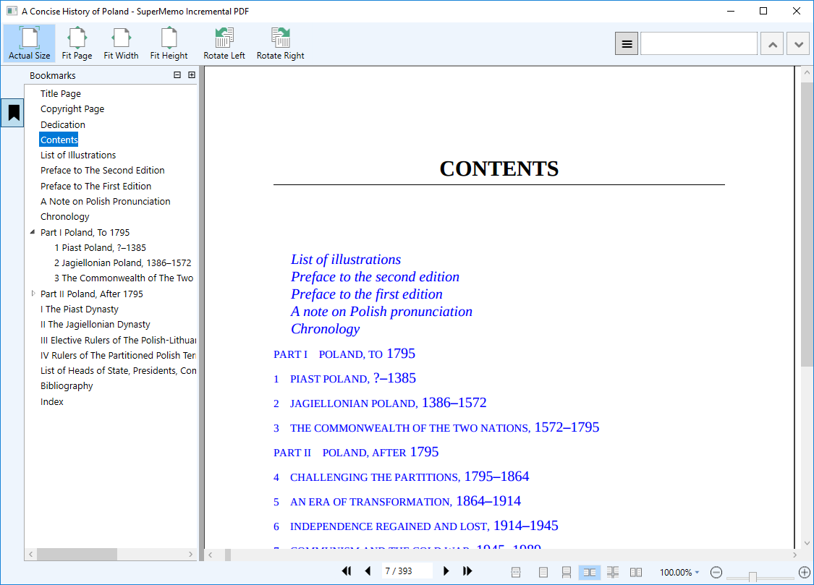
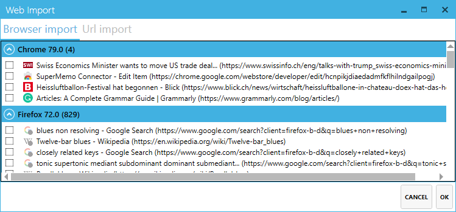

## SMA 101

### First-time setup

Run `SuperMemoAssistant.exe`. If you can't find SMA, learn how to [create a shortcut](qs-installation#optional-create-a-shortcut).

?> ❔ On the first execution, SMA will ask you for your SuperMemo executable path.

!> If SMA cannot find your SuperMemo executable, and you do not know how to find it, [follow this procedure](#i-can39t-find-my-supermemo-executable-path).

### Selecting your collection

The first window in SMA is the **Collection Browser**. It allows you to add, and select **which collection to use**.

- **To add a new collection**: Press the <kbd>Browse</kbd> button, and select your `.kno` collection file.
- **To open your collection**: Make sure it is *selected from the list*, then click <kbd>Open</kbd>, or press <kbd>enter</kbd>.

?> Once SuperMemo is running, you can use it just as you normally would. **Additional keyboard shortcuts** and **interactions** are adjoined by SMA.

You can always know whether SMA is running by checking the robot icon in your **tray bar** (image 👉)

## SMA 102

### PDF: Importing

1. Make sure **SuperMemo** is focused
2. Press <kbd>Ctrl</kbd> + <kbd>Alt</kbd> + <kbd>I</kbd> to open the **File picker dialog**
3. Select your `.pdf` file, and press the <kbd>Open</kbd> button

!> If you cannot find the File Picker Dialog, use <kbd>Alt</kbd> + <kbd>Tab</kbd> to find a window called **"Open"**. It might sometime open in the background.

?> A **new element** will be created **in SuperMemo** for you. You can recognize <dfn aria-label="Element in SuperMemo which contains the data relating to an imported PDF.">[**PDF elements**](#glossary)</dfn> by their content, see below:

### PDF: Opening, closing

?> To **start working** with one of your PDF, navigate to the <dfn aria-label="Element in SuperMemo which contains the data relating to an imported PDF.">**PDF element**</dfn> that was created in SuperMemo. The <dfn aria-label="The window that displays the actual PDF, and where extracts can be created.">[PDF window](#glossary)</dfn> will be opened.

?> ❔ To **close** the PDF, either **close the Window** as you normally would, or **navigate to another element**.

### PDF: Extracting

#### Extracting text

1. Select text with your mouse
2. Press <kbd>Alt</kbd> + <kbd>X</kbd>

  

!> If <kbd>Left click</kbd> selects the whole page, or large chunks of it, this is likely related to the format of your PDF. You will have to modify it, e.g. by using an OCR software, or editing the problematic content. If this is not an option, you can also extract images (see below).

#### Extract images

There are **two modes** for extracting images:

1. **Image selection**: <kbd>Left click</kbd> on the image. An overlay will be displayed to indicate your selection **(A)**. <kbd>Alt</kbd> + <kbd>X</kbd> to extract.

2. **Area snapshot**: Hold <kbd>Left click</kbd> or <kbd>Right click</kbd>, then drag your mouse **(B)**. <kbd>Alt</kbd> + <kbd>X</kbd> to extract.

?> <kbd>Right click</kbd> will force the selection mode to **Area snapshot** (i.e. even if your cursor is current over some text, or over an image).

#### Multi-selection

SMA allows you to **select as many objects** to extract as you desire. To start a multi-selection, **hold** the <kbd>Ctrl</kbd> key, and select your content as you normally would.

?> ❔ SMA will automatically try to fit your content to make the best use of the space in SuperMemo. You can create new [layouts](#) to change the default arrangement.

### Browser: Setup

To connect your browser to SMA, you will need to download the browser extension **SuperMemo Connector**.
- [SuperMemo Connector (Firefox)](https://addons.mozilla.org/en/firefox/addon/supermemo-connector/?src=search)
- [SuperMemo Connector (Chrome)](https://chrome.google.com/webstore/detail/supermemo-connector/hcnpikjdiaedadmfkflhilndgailpogj)

### Browser: Importing

There are **two ways** to import tabs from your browser:

1. **In SuperMemo**, press <kbd>Ctrl</kbd> + <kbd>Alt</kbd> + <kbd>Shift</kbd> + <kbd>A</kbd>

2. **In the Browser**, <kbd>Right click</kbd> on the *SuperMemo Connector* icon . Then select, either of:
  - Import all Tabs into SuperMemo (Current window)
  - Import all Tabs into SuperMemo

### Browser: Filtering & personalizing

## SMA 103

### Plugins

- [Incremental PDF](plugins-PDF.md) unlocks the power of SuperMemo for PDF files.
- [LaTeX](plugins-LaTeX.md) integrates LaTeX in your SuperMemo elements.
- [Import](plugins-Import.md) lets you finally get rid of old Internet Explorer.
- [Dictionary](plugins-Dictionary.md) will expand your vocabulary with the help of Oxford dictionary.

### Changing keyboard shortcuts

### Settings

## Glossary

- **PDF element**: [Element in SuperMemo](content/images/plugins-PDF/pdf-element.png ':ignore'), which contains the data relating to an imported PDF.
- **PDF window**: [The window](content/images/plugins-PDF/pdf-window.png ':ignore') that displays the actual PDF, and where extracts can be created.

## FAQ

### I can't find my SuperMemo executable path

1. Find your shortcut to `sm1x.exe` (the one you use to run SuperMemo)
2. <kbd>Right click</kbd> on the shortcut, then click on **More**, and finally click on **Open file location**

3. In the new Windows Explorer window, <kbd>right click</kbd> on the `sm1x` shortcut, and click on **Properties**.

4. In the file property dialog, find the **Target** text box. This is the location of your SuperMemo executable.

