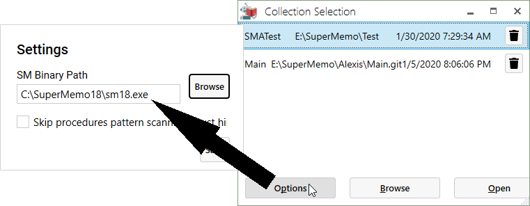

## Startup options

### Changing SuperMemo executable path

1. In the **Collection Selection** window, click on the <kbd>Options</kbd> button.
2. Make sure the **SM Binary Path** is correct. Use the <kbd>Browse</kbd> button to select your `sm1?.exe`, if it is not.

